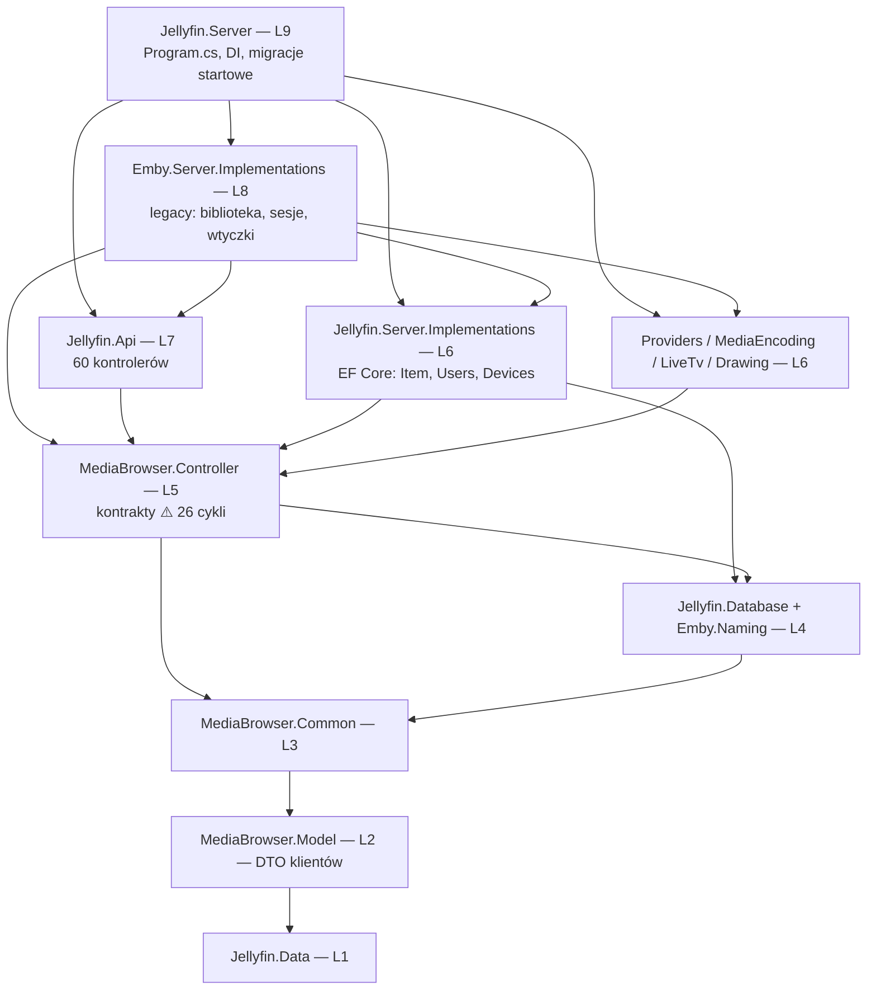

# Mapa repo — Jellyfin server

**Dokument onboardingowy.** Synteza trzech artefaktów: [terytorium](artifact-1-territory.md) (historia gita), [struktura](artifact-2-structure.md) (graf zależności), [kontrybutorzy](artifact-3-contributors.md).
**Okno:** 2025-09-12 → 2026-09-10. **HEAD:** `1d7b6d9784`.

## 1. TL;DR

Jellyfin to backend serwera mediów w ASP.NET Core (.NET 10, 43 projekty, ~2100 plików `.cs`); klient webowy mieszka w osobnym repo i tej mapy nie obejmuje. Architektura assembly jest zdyscyplinowana — graf `ProjectReference` to czysty DAG bez cykli, z trzema fundamentami (`MediaBrowser.Model`, `MediaBrowser.Common`, `MediaBrowser.Controller`). Cała praca ostatniego roku koncentruje się w jednym wątku: **przepisywanie warstwy danych na EF Core**, którego epicentrum to `Jellyfin.Server.Implementations/Item/BaseItemRepository.*` (3350 linii w pięciu partialach, #1 w churnie). Boli w dwóch miejscach: warstwa kontraktów `MediaBrowser.Controller` jest wewnętrznie splątana (26 cykli, wszystkie w jednym projekcie, `Entities` w 22 z nich), a najgorętszy kod jest wiązany przez DI — więc **kompilator nie ostrzeże, gdy go zepsujesz**. Ryzyko organizacyjne przewyższa techniczne: jedna osoba jest czołowym autorem w 7 z 9 kluczowych obszarów, a architekt migracji EF Core przestał commitować w czerwcu 2026. Jedyna część repo ze zdrowo rozłożoną wiedzą to encoding/ffmpeg.

## 2. Teren

### Duża odpowiedzialność vs peryferia

**Rdzeń** (churn + fan-in + cykle): `MediaBrowser.Controller/Entities` (churn #3, fan-in 119), `Emby.Server.Implementations/Library` (churn #4, fan-out 52), `Jellyfin.Server.Implementations/Item` (churn #1).

**Peryferia aktywne**: `MediaBrowser.Providers/Plugins/Tmdb`, `MediaBrowser.MediaEncoding/Subtitles`, `src/Jellyfin.LiveTv` — samodzielne, zmieniane niezależnie od rdzenia.

**Fundament stabilny**: `MediaBrowser.Model/Entities` — najwyższy fan-in w repo (129) przy niskim churnie. Działa jak fundament powinien.

### Moduły głębokie i płytkie

| typ | przykład | co to znaczy |
|---|---|---|
| głęboki, gorący, **centralny** | `MB.Controller/Entities` — fan-in 119, 22 cykle | najdroższe zmiany w repo |
| głęboki, gorący, **niewidoczny** | `JSI/Item` — churn 279, fan-in **5** | wiązany przez DI; brak siatki kompilatora |
| płytki konsument | `Jellyfin.Api/Controllers` — fan-out 98, fan-in 2 | liść grafu; odbiorca zmian, nie źródło |
| całkowity liść | `Jellyfin.Server/Migrations/Routines` — fan-in **0** | nic od niego nie zależy, ale zmiany nieodwracalne |

**Tu struktura katalogów kłamie:** `JSI/Item` wygląda na zwykły katalog implementacji, a jest epicentrum całego roku pracy. Odwrotnie `Migrations/Routines` — wygląda na rdzeń serwera, a jest izolowanym liściem.

### Aktywność w czasie

Wolumen rośnie 2× (275 → 319 → 481 → 566 commitów na kwartał). Po normalizacji widać trzy rzeczy:

- **Migracja EF Core** ciągnie się przez wszystkie cztery kwartały bez oznak domknięcia.
- **Fala API w P3** (marzec–czerwiec 2026) była jednorazowa — skoordynowana zmiana kontraktu (`Api` + `Model` + testy integracyjne), zamknięta.
- **Skok testów w P3–P4** — pięciokrotny wzrost po normalizacji. Racjonalna reakcja na wiązanie przez DI, ale oparta na jednej osobie.

> ⚠️ Surowy `git log` dla `Migrations/Routines` zawyża wyniki o 33 — commit `f73fc1fe` (2026-05-15) przemianował 33 pliki naraz. Wszystkie liczby w tej mapie są po korekcie. Dla tego katalogu używaj `git log --follow`.

## 3. Realne powiązania

Każde sprzężenie z oznaczeniem, **skąd o nim wiem**.

| sprzężenie | źródło dowodu | koszt zmiany |
|---|---|---|
| `MB.Controller/Entities` ↔ `Library` ↔ `Providers` ↔ `Persistence` | **graf importów** — 26 cykli 3-elementowych, wszystkie wewnątrz `MB.Controller` | wysoki, ręczny |
| `JSI/Item` → `MB.Controller/Persistence` (11 plików) | **graf importów** | średni, ręczny |
| `JSI/Item` ↔ `ESI/Library` ↔ `Api/Controllers` ↔ `Entities` | **tylko historia gita** — 33/31/24 wspólnych commitów. **Zero krawędzi w grafie importów** | wysoki, ręczny, **niewidoczny dla kompilatora** |
| `MB.Controller/Persistence` ← `JSI/Item` (conf 100% w historii) | **historia gita**; graf mówi, że zależność w tę stronę **nie istnieje** i istnieć nie może (L5 vs L6) | to dyscyplina zespołu, nie kod |
| `JDB/ModelConfiguration` → `Sqlite/Migrations` (conf 100%) | **graf + historia** | średni; obowiązek proceduralny |
| `JellyfinDbModelSnapshot.cs` ↔ cała warstwa danych | **historia gita**; 0 commitów solo, 18/21 w commitach >5 plików | 🔄 **regeneracja** — tanie |
| `Core/en-US.json` → ~30 plików tłumaczeń | **historia gita** | 🔄 **regeneracja** (Weblate) — tanie |
| `Directory.Packages.props` ↔ wszystko | **historia gita — pozorne**. 83 z 93 zmian to commity jednoplikowe (Renovate) | brak sprzężenia |

### Sprzężenia, których żadne narzędzie tu nie objęło — `unknown`, nie „brak"

- **Wiązanie przez DI i refleksję.** `ApplicationHost.DiscoverTypes()` skanuje assembly i rozwiązuje `GetExportTypes<T>()` w runtime. To główny mechanizm spinania tego systemu i **nie ma go w żadnym grafie**. Dlatego `JSI/Item` ma fan-in 5 przy churnie 279.
- **Wtyczki zewnętrzne.** Ładowane refleksją z katalogu wtyczek, konsumują te same interfejsy. Zmiana publicznego kontraktu psuje kod poza repo — niewidoczny dla wszystkiego, co tu policzyliśmy.
- **Klient webowy** (`jellyfin-web`) — osobne repo, inny język. Konsumuje API. Zero pokrycia.
- **ffmpeg** — wywoływany jako proces zewnętrzny. `EncodingHelper` buduje stringi argumentów; poprawność kontraktu weryfikuje dopiero runtime.
- **SQL generowany przez EF Core** — zapytania powstają z wyrażeń LINQ. Wydajność i poprawność nie wynikają z grafu.
- **Code review** — liczyliśmy tylko `author`. Kto recenzował (często zna obszar najgłębiej) jest niewidoczny.

## 4. Strefy ryzyka

| # | strefa | dlaczego |
|---|---|---|
| 1 | `MB.Controller/Entities` + `BaseItem.cs` | fan-in 119, 22 cykle, 3061 linii — zmiana promieniuje najszerzej w repo i nie da się jej przetestować w izolacji |
| 2 | `JSI/Item/BaseItemRepository.*` | churn #1 i wciąż rośnie, 3350 linii w 5 partialach, wiązany przez DI — kompilator nie złapie zepsutego kontraktu |
| 3 | `ESI/Library/LibraryManager.cs` | 24 zależności w konstruktorze, 4150 linii, fan-out 52 — jednostkowo nietestowalny, tylko test integracyjny |
| 4 | `Jellyfin.Server/Migrations` + `JDB` | zmiany nieodwracalne, **zero testów**, cykl `Entities`↔`Interfaces` (27↔3), a architekt obszaru wygasł w P4 |
| 5 | `MB.Controller/MediaEncoding/EncodingHelper.cs` | 8019 linii — największy plik w repo; poprawność argumentów ffmpeg weryfikuje dopiero runtime |
| 6 | **koncentracja wiedzy** | jedna osoba to 396 z ~900 commitów kodu i czołowy autor w 7 z 9 obszarów |

## 5. Kogo zapytać

| strefa | pierwszy kontakt | drugi |
|---|---|---|
| rdzeń: encje, repozytorium, biblioteka, API | **Shadowghost** (57–59% commitów w każdym) | theguymadmax — generalista rdzenia, stabilny przez 4 kwartały |
| migracje EF Core, wieloproviderowość, PostgreSQL | **JPVenson** — autor `src/Jellyfin.Database/readme.md`, 42 commity w rutynach. **⚠️ zero commitów w P4, ostatni 2026-06-07 — pytać szybko** | Cody Robibero — profil utrzymaniowy, najświeższy commit w repo |
| ffmpeg, akceleracja sprzętowa, transkodowanie | **nyanmisaka** (od 2020) | gnattu — enkoder + testy encodingu |
| napisy, probing mediów | **Bond_009** — 1018 commitów, najdłuższy staż | Tim Eisele |
| kontrakt API, providery książek | **dkanada** (od 2019, 54 commity w `Controllers`) | Niels van Velzen ⚠️ wygasa |
| kontrakt zapytań (`InternalItemsQuery`, `Model/Querying`) | **TheMelmacian** — jedyni łączący `Item` + `Querying` + `Persistence` | — |
| testy, `Jellyfin.Extensions` | **Marc Brooks** — weszli w P3 z profilem testowym | — |

## 6. Pierwszy dzień — co przeczytać, w tej kolejności

1. **`CLAUDE.md`** — ograniczenia builda, które wywrócą pierwszy PR: `TreatWarningsAsErrors`, analizatory tylko w Debug, `BannedSymbols.txt`, własny analizator JF0001, centralne wersje pakietów.
2. **`Emby.Server.Implementations/ApplicationHost.cs`** (~1000 linii, zacznij od `DiscoverTypes`, `GetExportTypes<T>`, `RegisterServices`, `GetComposablePartAssemblies`) — prawdziwy composition root. Bez tego nie zrozumiesz, czemu grafy zależności pokazują tak mało.
3. **`MediaBrowser.Controller/Entities/BaseItem.cs`** — model domenowy, fan-in 119. Czytaj jako słownik pojęć, nie jako kod do zmiany.
4. **`Jellyfin.Server.Implementations/Item/BaseItemRepository.cs`** (267 linii — sam wierzchołek; partiale `TranslateQuery` 1296, `QueryBuilding` 699, `Querying` 662, `ByName` 426 na później) — epicentrum roku pracy. Konstruktor bierze 5 interfejsów; to wzorzec, który warto naśladować.
5. **`MediaBrowser.Controller/Persistence/IItemRepository.cs`** + **`MediaBrowser.Controller/Library/ILibraryManager.cs`** — kontrakty, które w 100% i 63% commitów jadą razem z implementacją. Tu zobaczysz, gdzie przebiega prawdziwa granica.
6. **`src/Jellyfin.Database/readme.md`** — procedura migracji wieloproviderowej. Krótkie, a pominięcie kosztuje odrzucony PR.
7. **`Jellyfin.Server/Program.cs`** + **`Startup.cs`** — jak to się uruchamia, gdzie wchodzą migracje startowe.
8. **`Jellyfin.Api/BaseJellyfinApiController.cs`** + jeden kontroler (`ItemsController.cs`, 1179 linii) — wzorzec warstwy API i polityk autoryzacji.

**Pierwsza zmiana — gdzie bezpiecznie zacząć:** `MediaBrowser.Providers/Plugins/*` (Tmdb, książki) albo `MediaBrowser.MediaEncoding/Subtitles`. Aktywne, ale peryferyjne — niski fan-in, brak cykli, rozłożona wiedza. Unikaj `MB.Controller/Entities` i `LibraryManager` przez pierwsze tygodnie.

## 7. Ograniczenia

**Okno.** Tylko 12 miesięcy i tylko gałąź `master`, bez merge commitów. Repo istnieje od 2018 — decyzje sprzed okna są niewidoczne. Praca w niescalonych gałęziach nie istnieje w tych danych.

**Metoda strukturalna.** Graf zbudowany z `ProjectReference` i dyrektyw `using`. **Nie widzi:** typów po pełnej nazwie kwalifikowanej, generyków rozwiązywanych w runtime i — najważniejsze — **wiązania przez DI**. Wszystkie liczby fan-in/fan-out to **dolne oszacowanie**. `dependency-cruiser` z oryginalnego promptu obsługuje tylko JS/TS; użyto własnych skryptów w [`tools/`](tools/).

**Metoda historyczna.** Churn liczy commity, nie wielkość zmian — jednoliniowa poprawka waży tyle co przepisanie pliku. Sprzężenia to korelacja w commitach, nie przyczynowość. Renamey skorygowane tylko tam, gdzie je wykryto (`Migrations/Routines`, workflowy openapi, dwa katalogi providerów).

**Czego ta mapa NIE mówi:**

- czy kod jest dobry — churn mierzy ruch, nie jakość;
- co jest zaplanowane — brak roadmapy w repo (czy `Emby.Server.Implementations` ma być wygaszane? historia nie odpowiada);
- kto naprawdę zna obszar — recenzenci są niewidoczni, a weterani o niskim churnie (Bond_009: 1018 commitów, 34 w oknie) wiedzą więcej, niż sugerują ostatnie 12 miesięcy;
- jak system zachowuje się w runtime — wydajność, SQL generowany przez EF, poprawność argumentów ffmpeg;
- co robi klient webowy i wtyczki zewnętrzne — poza zasięgiem całkowicie.

**Świeżość.** Stan na 2026-09-12. Przy tempie ~570 commitów na kwartał mapa zdezaktualizuje się w 2–3 miesiące. Skrypty w `tools/` pozwalają ją przeliczyć.
